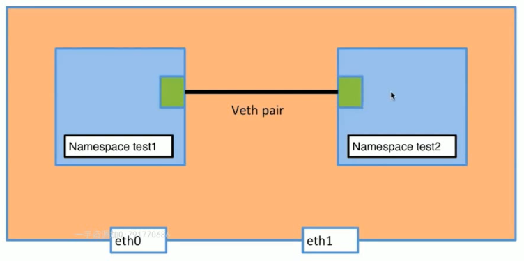
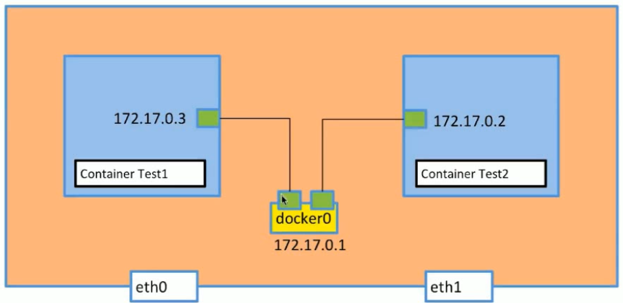
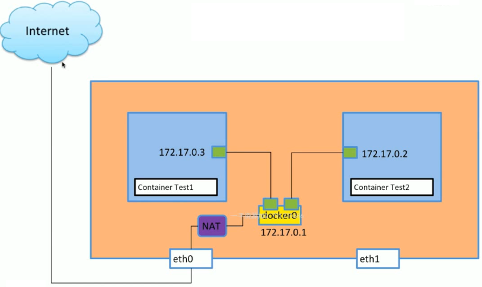
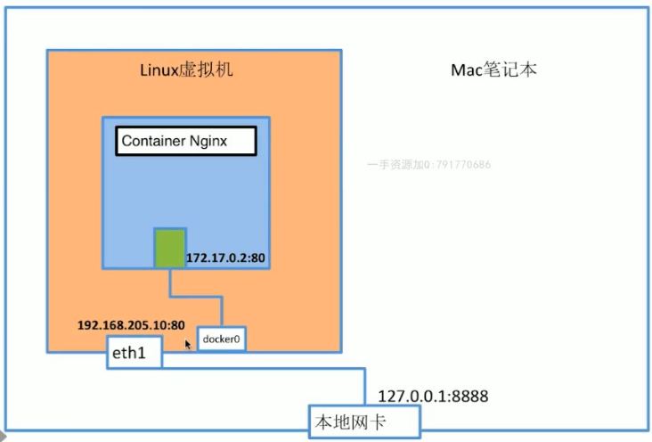

# docker的背景知识

## 满足了什么需求

- 开发中常常会出现环境问题：开发者的环境和运维人员或者测试人员的环境不一样，开发者的程序在自己的环境能够正常运行，但是在测试和运维的环境中就不能运行，这样就使得工作不能够正常运作；
- 实际工作中，常常会出现甩锅的现象，开发者可以将许多的问题归结为环境问题。

  > docker能够保证所有的部门运行的环境一致，从而解决这一痛点！


## 虚拟化和容器化的简介

### 虚拟化

虚拟化是以操作系统为单位，在物理机上虚拟出一个个独立的操作系统；并且会为每个虚拟机分配内存和磁盘的资源空间，可以在各个虚拟机上独立运行不同的应用。

### 容器化

容器化是以应用为单位，每个应用运行所需要的环境配置都包含在容器中，只要物理机上安装了docker，即可运行多个容器，不需要额外的操作系统，减少资源消耗。


## docker使用到的底层技术

docker也不是一款完全创新的应用，里面运用了已经存在了很久的Linux技术。

- Namespaces：是用来隔离pid，net，ipc，mut，uts
- Control groups：用来做资源限制，控制某个空间拥有多少容量
- Union file systems：容器和镜像的分层

现在是初步了解这些底层技术，往后有机会再深入了解。


# docker运行原理

### Docker是怎么工作的：

> 客户端发送命令，守护进程解析命令并调用**运行在主机上的容器**，容器是由镜像生成。


### 为什么docker这么快

- docker 不需要硬件资源虚拟化；
- docker 不需要重新加载一个操作系统，与宿主机共用。


# docker的三要素

## 仓库

​	是云端存储镜像的地方。

## 镜像

- 镜像是模板，一个镜像可以创造多个容器；
- 镜像是分层的，每个外层镜像里边都可能有子层；


### 获取镜像方式

- 第一种方式：使用 dockerfile 构建

- 第二种方式：从Registry拉取

  ```shell
  docker pull ubuntu:16.04
  ```


### 构建image

#### 初步构建自己的image

尝试构建一个最基本的 hello world 镜像

- 第一步：构建一个可执行文件

  - 首先使用C语言编写一个 hello world 程序

    ```c
    include<stdio.h>
    void main()
    {
            printf("hello shalom!\n");
    }
    ```

  - 编译成一个可执行文件( 这里将可执行文件命名为hello )

    ```shell
    gcc hello.c -o hello
    ```

    

- 第二步：编写 Dockerfile

  ```shell
  vim Dockerfile
  ```

  **注意：**上边的文件名固定为 Dockerfile

  填写如下内容：

  ```dockerfile
  FROM scratch
  add hello /
  cmd ["/hello"]
  ```

  **解释：**

  - 第一行：指定基于哪个镜像来构建当前镜像，写 scratch 意思是：当前镜像不基于其他镜像
  - 第二行：将当前目录下的 hello 可执行文件添加到 目录 / 中
  - 的三行：启动该镜像对应的容器时，会执行 `/hello` 命令


- 第三步：运行构建命令

  ```shell
  docker build -t shalom/hello-shalom .
  # -t：指定此镜像的tag，tag的格式为“作者/镜像名”
  # 最后一个 . 是指，使用当前目录下的 Dockerfile 来进行构建
  ```


#### 修改更新image

> 当启动一个image对应的container后，我们也许会在这个container中做许多操作，比如安装你写程序，增加一些配置文件等。当退出这个container后，我们也许就会有这么一个需求：将这个container中的改动打包到一个新的image中，这样下次启动就不需要再重复安装某些程序。


##### 通过 docker commit 命令操作

当以守护进程启动一个容器后，这里以 镜像Ubuntu 为例：

```shell
docker run -it ubuntu:16.04
```

我们也许会安装 vim

```shell
apt-get update
apt-get install -y vim
# -y: 代表执行yes（后边会询问是否同意占用空间）
```

然后再 exit 退出，这时候就存在一个已经处于Exit状态的 container，并且里边包含了安装好的vim

执行如下命令可将这个 container 打包成 image：

```shell
docker commit ${容器id或者名称} ${新镜像的名称}
```

这时候再去查看镜像，就会发现这个刚创建的新镜像。


##### 通过 Dockerfile 来操作

上述效果还可以通过Dockerfile来实现，在工作目录下创建文件 Dockerfile：

```dockerfile
# 这里也可以使用镜像名：ubuntu:1604
FROM c6a43cd4801e
RUN apt-get update
RUN apt-get install -y vim
```

然后再当前目录下执行命令：

```shell
docker build -t shalom/ubuntu-vim .
```

docker会利用当前目录下的 Dockerfile 来创建一个名为 shalom/ubuntu-vim 的新镜像，这样也达成了和使用 docker commit 一样的效果。


## 容器

- 可以把容器看做一个精简版的Linux环境；
- 容器需要镜像生成；
- 真正干活的是容器；


### container与image的关系

- image是可读不可写的，container是可读可写的
- container可以看成是image的一份copy
- 他两之间的关系可以类比为：类 和 实例 的关系，image是类，container是实例


### 容器资源管理

--memory   --cpu-shares


## 3. 基本命 令介绍

### 3.1 docker run

#### 使用方法：

```shell
docker run [容器名] # 
```

#### 使用细节：

> 当容器名指定的容器不存在时，docker控制器会找到同名image，若image还是不存在，则会从仓库拉取(pull)同名镜像。


### 3.2 进入容器的两个命令

```shell
docker attach 容器ID
docker exec 容器ID
```


## 4. dockerFile & docker-compose


## 注意要点：

1. docker容器进程前台没有应用就会自动关闭；


## 数据卷命令

docker 	专门提供了 volume 子命令来操作数据卷：
**create**        创建数据卷
**inspect**      显示数据卷的详细信息 
**ls**               列出所有的数据卷
**prune**        删除所有**未使用的 volumes**，并且有 -f 选项
**rm**             删除一个或多个未使用的 volumes，并且有 -f 选项


## 配置docker加速器

1. 访问网站 https://www.daocloud.io/mirror#accelerator-doc 将里边对应系统的命令copy并执行，注意里边的使用系统版本：

   ```shell
   curl -sSL https://get.daocloud.io/daotools/set_mirror.sh | sh -s http://f1361db2.m.daocloud.io
   ```

2. 修改docker的 daemon.json 文件

   ```shell
   vim /etc/docker/daemon.json
   ```

3. 添加`, "insecure-registries": []` 一段

   ```shell
   # 添加后
   {"registry-mirrors": ["http://f1361db2.m.daocloud.io"],"insecure-registries": []}
   ```

4. 重启docker

   ```shell
   systemctl restart docker
   ```


：

虚拟化是以操作系统为单位，在物理机上虚拟出一个个独立的操作系统；

会为每个虚拟机分配内存和磁盘的资源空间；

可以在各个虚拟机上独立运行不同的应用。


容器化是以应用为单位，每个应用运行所需要的环境配置都包含在容器中，只要物理机上安装了docker，即可运行多个容器，不需要额外的操作系统，减少资源消耗。


WordPress可以了解一下，会有用处


# Dockerfile的语法

当我们需要构建一个镜像时，就需要编写Dockerfile。Dockerfile的语法其实很简单，主要就是需要理解几个关键字，下面就一个一个看看。

## FROM关键字

FROM一般在一个Dockerfile文件的开头，用来指定 我这个image是基于哪个镜像构建的 ，也就是指定base image。一般写法有如下几种情况：

```dockerfile
FROM scratch 		# 代表没有base image 
FROM centos			# 使用latest版本的centos
FROM ubuntu:16.04	# 使用16.04版本的ubuntu
```

一般使用FROM关键字的时候，尽量使用官方提供的image，编程者们达成共识，以免出错。


## LABEL关键字

LABEL关键字可以为 image 添加一些注释信息，这些信息是以键值对的格式添加的，格式如下：

```dockerfile
LABEL <key>=<value> <key>=<value> <key>=<value> ...
```

我们来看一些直观的例子：

```dockerfile
LABEL version="1.0" 
LABEL description="This text illustrates that label-values can span multiple lines."
LABEL "com.example.vendor"="ACME Incorporated"
```

可以指定 版本号，对此镜像的描述；还可以自定义一个key，就像第三行。

若要将每个键值对写成一行，只需要用空格隔开，例如：

```dockerfile
LABEL version="1.0" description="This text illustrates that label-values can span multiple lines." "com.example.vendor"="ACME Incorporated"
```

**注意：**

- value中有空格，需要使用双引号

- value中需要换行，可以使用 \

  ```dockerfile
  LABEL description="This text illustrates that label-values \
  can span multiple lines."
  ```

- value之间也可以换行

  ```dockerfile
  LABEL version="1.0" \
  	  description="This text illustrates that label-values can span multiple lines."\
  	  "com.example.vendor"="ACME Incorporated"
  ```

  

## RUN关键字

在我们生成 image 之前，我们也许会想要执行一些命令，这个时候就需要使用到 RUN 命令。

```dockerfile
RUN yum update && yum install -y vim
```

**注意：**每写一行 RUN 指令，构建 image 的时候就就会增加一层；上述语句将两个命令写在一个 RUN 语句中，那么在镜像中就是一层，当然也可以分开写在两条 RUN 语句中，这样 image 中就包含两层；没有特殊要求，一般会将多个命令写在一个 RUN 语句中，**避免无用分层**。

为了美观，我们也可以使用 `\` 来换行，比如：

```dockerfile
RUN yum update && yum install \
	-y vim
```


## WORKDIR关键字

WORKDIR是指定工作目录的命令，指定启动容器启动后进入的工作目录；与 RUN 命令结合使用的时候需要注意：

```dockerfile
WORKDIR /test
RUN pwd
```

执行结果为 `/test`，值得一提的是：如果没有路径为 `/test` 的文件夹，系统会自动创建。

还有一种情况需要注意：

```dockerfile
WORKDIR /test
WORKDIR demo
RUN pwd
```

这个时候的结果为 `/test/demo`，这时候会自动拼接，**注意：**第二行没有带根路径，若使用的是 `/demo`, 那么就是

`/demo`。

在实际使用过程中，`RUN cd` 的效果和 `WORKDIR` 效果相同，但是一般不推荐使用 `RUN cd` ，还是避免无用分层；还有就是尽量使用绝对路径。


## ADD和COPY关键字

这两个命令都可以将本地的文件添加到 image 中

```dockerfile
ADD hello /  # 将当前目录下的hello文件添加到镜像的根目录下
COPY hello / # 效果相同
```


不同的是：ADD 还有解压缩的功能。

```dockerfile
ADD test.tar.gz /testdir # 会将test.tar.gz解压到镜像中的 /testdir 中
```


和 WORKDIR 使用的时候需要注意

```dockerfile
WORKDIR /root
COPY hello test/
# 最终hello的路径为：/root/test/hello
```


一般使用的时候，优先考虑 COPY ，需要解压缩的时候就选择 ADD。


## ENV关键字

ENV关键字是用来设定常量的，类似 GO语言 中的 const。它的好处就是：使得Dockerfile文件更容易维护。

```dockerfile
ENV MYSQL_VERSION 5.6
RUN apt-get install -y mysql-server="${MYSQL_VERSION}"
```


## VOLUME关键字

用于存储

## EXPOSE关键字

用于网络

## CMD关键字


## ENTRYPOINT关键字


## 查看官方提供的 Dockerfile

在GitHub中找到 docker-library，里面有官方提供的各个镜像的 Dockerfile，[访问这里](https://github.com/docker-library)


# docker的网络

ping 和 telnet 两个工具命令的使用

wireshark的使用


## Linux的网络命名空间 ( namespace )

> 这里只是暂时对 namespace 做一个简单的介绍，大部分是操作性的内容，背后的原理还需要仔细学习计算机网络。

首先，准备一台Linux虚拟机，执行命令查看现有的 namespace 列表

```shell
# netns 代表的意思是：network namespace
ip netns list
```

可能存在，也可能不存在，这都不重要，继续后边的操作：添加一个新的 namespace

```shell
ip netns add test1
# 顺便带上删除 namespace 的命令
ip netns delete test1
```

再执行查看列表命令，就会发现列表中有 test1

再添加一个 namespace ：

```shell
ip netns add test2
```

查看新建的 namespace 里面的网络接口：

```shell
ip netns exec test1 ip a
# 上述命令其实和 docker exec 命令很像
# 是在 test1 里边执行 ip a 命令
# 同样的，也可以在namespace里边执行 /bin/bash 命令，可以看出namespace和docker的container有许多相似之处
```

执行上述命令，会发现只有一个 处于Down状态的 lo 接口（本地回环接口）

在查看 namespace 中的 link：

```shell
ip netns exec test1 ip link
```

也出现一个 Down 状态下的 link

再将这个 link 启动：

```shell
ip netns exec test1 ip link set dev lo up
```

再次执行查看命令`ip netns exec test1 ip link`，会发现这个 link 的状态变成了 UNKNOWN。为什么不是 UP？是因为只有两个接口相互连通，状态才为UP，孤立一个就为 UNKNOWN。


要想连通 test1 和 test2 两个 namespace，就需要创建一对 link，注意：link 是一对一对的。

```shell
ip link add veth-test1 type veth peer name veth-test2
```

这样就创建了两个名为 veth-test1 和 veth-test2 的 link。通过下边命令就可以查看到：

```shell
ip link
```


然后分别将两个 link 放在我们之前创建的两个 namespace 中

```shell
ip link set veth-test1 netns test1

ip link set veth-test2 netns test2
```

再去查看 namespace 中的网络接口：

```shell
ip netns exec test1 ip a
```

发现已经将 link 添加到 test1 中了，我们再执行 `ip link` 会发现原来存在的两个 link 不见了


然后我们给两个 namespace 中的 link 添加 IP地址：

```shell
ip netns exec test1 ip addr add 192.168.1.221/24 dev veth-test1
```


最后启动两个 namespace 中的 link：

```shell
ip netns exec test1 ip link set dev veth-test1 up
```


这是我们就可以将两个 namespace 连通

```shell
ip netns exec test1 ping 192.168.1.222
```


通过这一番操作，可以对 Linux 中的 namespace 有一个初步的认识，背后的理论基础，则需要在计算机网络这门学科中寻找答案。下图或许对理解原理有所帮助：




## 容器之间是如何连通的？

要解释这个问题，需要先知道几个概念。我们执行命令

```shell
docker network ls
```

会将 docker 的网络展示出来，结果如下：

```shell
NETWORK ID          NAME                DRIVER              SCOPE
8e3f5574bad3        bridge              bridge              local
8f06a8011f6a        host                host                local
dac426bfdce5        none                null                local
```

有三个网络，先将简单的解释清楚：

### host

使用这个网络启动的container，将会和宿主机共享网卡和IP/端口

### none

使用 none 启动的container，是一个封闭式的container，外界将不能通过网络连接到它，它没有 IP地址。唯一能打开这个 container 的方式就是：本地执行命令 `docker exec` 

### bridge

容器通过一个网桥，来连接宿主机的 docker0 网卡。下面我们来验证一下：

执行命令 `ip a`，会看到一串结果，注意其中的两个结果

```
3: docker0: <BROADCAST,MULTICAST,UP,LOWER_UP> mtu 1500 qdisc noqueue state UP group default 
	...
31: veth492282f@if30: <BROADCAST,MULTICAST,UP,LOWER_UP> mtu 1500 qdisc noqueue master docker0 state UP group default 
    ...
```

veth492282f 是 docker0 的 link，用来和container连接的，自然与之配对的另一个 link 就存在与当前运行的容器中（我目前只运行了一个容器）。执行下面命令查看对应的 link：

```shell
docker exec test1 ip a
```

结果：

```
1: lo: <LOOPBACK,UP,LOWER_UP> mtu 65536 qdisc noqueue qlen 1
    ...
30: eth0@if31: <BROADCAST,MULTICAST,UP,LOWER_UP,M-DOWN> mtu 1500 qdisc noqueue 
    ...
```

其中 eth0@if31 就是与 veth492282f 配对的 link，我们可以使用命令 `brctl show` 命令来验证，没有安装 brctl 工具可以执行下列命令安装：

```shell
sudo apt install bridge-utils
```

验证结果：

```shell
bridge name	 bridge id			STP enabled		interfaces
docker0		 8000.0242f9ac6e12	no				veth492282f
```

如果我们再启动一个 container，docker0网桥将会增加一个 interface

```shell
docker run -d --name test2 busybox /bin/sh -c "while true;do sleep 3600;done"

brctl show

bridge name		bridge id			STP enabled		interfaces
docker0			8000.0242f9ac6e12	no				veth492282f
													veth88521cd
```


通过上面一个过程，我们可以知道 container 之间的通讯是通过 宿主机的docker0 来完成的，如下图：




### overlay

多宿主机的时候使用


## 容器是如何连接外网的？

通过上边的理解，我们也很容易就能够理解 container 是如何连接外网的。如下图：





图中的 NAT 是网络地址转换技术。


## 需要注意的使用技巧

### container 的link机制

**效果：** 容器名 和 ip 做了 DNS映射。

在启动一个新容器的时候，加上 --link 指定你要 link 的容器（这个容器是UP状态），如下：

```shell
docker run -d --name test2 --link test1 busybox /bin/sh -c "while true;do sleep 3600;done"
```

这样就可以直接这样：

```shell
docker exec -it test2 /bin/sh
ping test1
```

但是 test1 不可以直接 `ping test2`，但是使用我们自定义的网桥的时候，是可以反向ping通的


### 使用自定义网桥

创建网桥：

```shell
docker network create -d bridge my-bridge
# -d 指定网桥类型
# 最后是自定义的网桥名
```

通过命令`brctl show` 可以查看自己新建好的 bridge


新建容器的时候，在命令中加上 --network 来指定你要使用的 bridge

```shell
docker run -d --name test3 --network my-bridge busybox /bin/sh -c "while true;do sleep 3600;done"
```

可以通过命令：

```shell
docker network inspect 67976cf298ff
# 最后的是网桥id
```

查看网桥的详细信息，在信息中可以找到这个网桥包含的 container 


一个 container 可以连接多个 bridge，连接命令如下：

```shell
docker network connect my-bridge test1
```


### 容器的端口映射

容器可以将自身的端口和宿主机的端口连接起来，用户可以直接访问宿主机的ip+绑定的端口，就可以访问当容器的服务。

我们使用 Nginx镜像来实现这个效果，执行命令：

```shell
docker run --name web -p 80:80 -d nginx
```

加上 -p 容器端口:宿主机端口 ，这样就可以实现端口映射。





## 多容器组合的使用

### 一个简单的例子

一个用Python写成的简单服务器，使用到了Redis，代码如下：

```python
from flask import Flask
from redis import Redis
import os
import socket

app = Flask(__name__)
redis = Redis(host=os.environ.get('REDIS_HOST', '127.0.0.1'), port=6379)


@app.route('/')
def hello():
    redis.incr('hits')
    return 'Hello Container World! I have been seen %s times and my hostname is %s.\n' % (redis.get('hits'),socket.gethostname())


if __name__ == "__main__":
    app.run(host="0.0.0.0", port=5000, debug=True)
```


我们将Redis单独在一个容器中启动，项目单独启动一个容器。Redis容器可以使用官方提供的Redis镜像，项目服务使用下边的Dockerfile启动：

```dockerfile
FROM python:2.7
LABEL maintaner="Peng Xiao xiaoquwl@gmail.com"
COPY . /app
WORKDIR /app
RUN pip install flask redis
EXPOSE 5000
CMD [ "python", "app.py" ]
```

相信通过上边对 Dockerfile 语法的讲解，这个 Dockerfile 应该是很好理解了。

我们开始启动 Redis：

```shell
docker run --name redis -d redis
```

再启动我们的 App，这里要将Redis关联上，并且设置代码中使用到的环境变量 REDIS_HOST，最后还不要忘记进行端口映射：

```shell
docker build -t flask-redis .
docker run --link redis -e REDIS_HOST=redis -p 5000:5000 -d flask-redis
```

启动成功后，我们在宿主机上使用如下命令访问这个服务：

```shell
curl http://127.0.0.1:5000
```


### 第二个例子


部署WordPress：

```shell
docker run -d --name mysql -v mysql-data01:/var/lib/mysql -e MYSQL_ROOT_PASSWORD=root -e MYSQL_DATABASE=wordpress db39680b63ac

docker run -d -e WORDPRESS_DB_HOST=mysql:3306 --link mysql -p 8080:80 wordpress
```


# docker的持久化

## 使用数据卷(Volume)

给数据卷重命名

```shell
docker run -d -v mysql:/var/lib/mysql --name mysql1 -e MYSQL_ALLOW_EMPTY_PASSWORD=true mysql
# -v 新名称:数据卷挂载路径
# 需要再重新使用原有的数据卷，还是使用 -v 命令
```


## bind Mounting

和使用数据卷类似，是将本地的目录和容器中的目录做了一个映射：

```shell
docker run -d -v ~/mysql:/var/lib/mysql --name mysql1 -e MYSQL_ALLOW_EMPTY_PASSWORD=true mysql
```


# docker swarm 的使用

初始化

```shell
docker swarm init --advertise-addr=192.168.1.212
```

其他服务器加入worker

```shell
docker swarm join --token SWMTKN-1-1pm95quesbw433wf6nie87c1kgl2zsntru8aqqinfc2dggz5q8-9usnd12nuythh52ydy8406fb0 192.168.1.212:2377
```

查看 swarm 系统中包含的节点

```shell
docker node ls
```

运行容器(服务)

```shell
docker service create --name demo busybox sh -c "while true;do sleep 3600;done"
```

查看服务列表，并查看详情：

```shell
docker service ls
docker service ps demo
```

横向扩展demo服务

```shell
docker service scale demo=5
```

删除服务

```shell
docker service rm demo
```


##

创建一个 overlay 的网络

```shell

```

创建一个MySQL服务

```shell
docker service create --name mysql --env MYSQL_ROOT_PASSWORD=root --env MYSQL_DATABASE=wordpress --network demo --mount type=volume,source=mysql-data,destination=/var/lib/mysql mysql
# --mount 指定持久化
```


# 小技巧

## 让当前用户也可以使用docker

一般安装完 docker 后，只有root用户才可以使用docker，要想让当前用户使用，可以采取如下方法：

```shell
#如果还没有 docker group 就添加一个：
$sudo groupadd docker
#将用户加入该 group 内。${USER}为当前用户名
$sudo gpasswd -a ${USER} docker
#重启 docker 服务
$systemctl restart docker
#切换当前会话到新 group 或者重启 X 会话
$newgrp - docker
#注意:最后一步是必须的，否则因为 groups 命令获取到的是缓存的组信息，刚添加的组信息未能生效，
#所以 docker images 执行时同样有错。
```


# docker听课笔记

**问题1：** 引用 ENV 定义的常量时，必须要用 “” 将${}括起来吗？

不一定，“”是命令要求的


**问题2：** CMD 和 RUN 还有 ENTRYPOINT 三者有什么区别？

以上三个关键字都有执行命令的作用，但是又各有所不同，使用的时候需要选择最优的关键字。

RUN：

- 执行命令，并且创建新的层

CMD：

- 容器启动时，默认执行的命令

- 如果我们执行启动容器时，指定了要执行的命令，那么CMD指定的命令就会被覆盖

  ```shell
  # 最后的命令可以不指定，若指定了，就覆盖CMD
  docker run -it ${镜像ID} [${命令}]
  ```

- 如果 Dockerfile 中指定了多个 CDM，以最后一个为准。

ENTRYPOINT：

- 也是容器启动时执行，不同的是它执行的方式是以服务的方式执行，不会被忽略，也不会被覆盖；

- 因为这个特性，它常常被用来执行脚本：

  ```dockerfile
  COPY docker-entrypoint.sh /user/local/bin
  ENTRYPOINT ["docker-entrypoint.sh"]
  ```

  先将脚本保存到 image 中的 PATH 目录下，然后直接用 ENTRYPOINT 执行。

- 执行启动容器时，指定了要执行的命令，ENTRYPOINT指定的命令不会被覆盖，并且启动容器命令指定的命令会被忽略。


**问题3：** 如何理解 image 层的概念？

当我们执行命令：

```shell
docker history ${镜像ID}
```

会得到这个镜像的所有分层信息，每执行一条 RUN 命令，就会多一层，展示出的信息有：分层时间，分层时执行的命令，当前层占用的空间大小 等。这就是 image 中的层，外层像洋葱一样包裹着内层。


**问题4：** exec格式是从哪里来的？只有Dockerfile才会使用到吗？它有什么是shell格式做不了的？


**问题5：** docker hub 使用的关键步骤，如何与GitHub关联，如何搭建私有的 registry

在第三章的第8节里


**问题6：** 将docker的命令都尝试使用一遍，再筛选出有用的


**问题7：** 

- 这个投票系统需要部署几个模块？
- 


**问题8：** 

**问题9：** 

**问题10：** 

**问题11：** 

**问题12：** 

**问题13：** 

**问题14：** 

**问题15：** 

**问题16：** 

**问题17：** 

**问题18：** 

**问题19：** 

**问题20：** 

**问题21：** 

**问题22：** 

**问题23：** 

**问题24：** 

**问题25：** 

**问题26：** 

**问题27：** 

**问题28：** 

**问题29：** 

**问题30：** 


